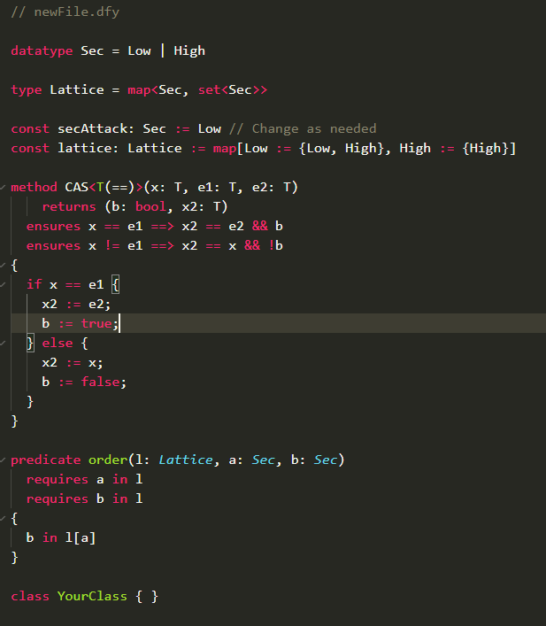
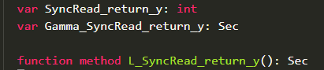

# DafnyInfoFlow
## About
This repository is the tool developed as part of my thesis project "Automating Information Flow Analysis Using Dafny". It extends and modifies the Dafny source code to add information flow assertions to a Dafny program. The assertions are used to prove a concurrent program is secure and are based on the work of Winter et al. [[1]](#1).
The tool runs in two phases.

1. **Initialisation** - This adds template code for the user to fill in.
2.  **Assertions** - This phase adds the information flow assertions to the given file.

## Use
A command line flag called `infoFlow` has been added to Dafny. This flag is used to perform the two phases mentioned above. The flag takes 3 values:
- 0 : (default) no information flow analysis is performed.
- 1 : Add initialisation code, for the user to fill in. The modified code is printed to a file of the same name with extension `.if.dfy`.
- 2 : Add the information flow assertions to the code, and print to the console.

### File Structure
It is recommended to start with a blank file and run the tool wit the `infoFlow:1` flag to generate a template file that the user can fill in. Then, the user can fill out the generated class with methods and member variables to represent the program to analyse.

The tool assumes that there is one class defined, that represents the program being analysed. Each unique thread in this program is represented by a method as a member of this "program" class. The global state shared between threads is simply the scope of the class. This allows for some simplifications in the logic of the tool, since local variables to threads, are now local to methods, and the tool does not have to deal with as many scoping issues, since Dafny will handle this. This is only of concern to the user, if they already have existing Dafny code modelling their program. Otherwise, running the tool to generate a template file is the best starting option.

### Recommended Command Line Flags
In general, the command to run the tool will look something like this:

`./Dafny.exe -compile:0 -env:0 -infoFlow:1 -dprint:optionalFile yourFile`

The `compile` flag tells Dafny to not compile to another language. The `env` flag stops Dafny printing information about the environment into the information flow file. The `infoFlow` flag works as defined above.
When using `infoFlow:2` the code with assertions is printed to the console. If you would like to play around with the assertions and receive error messages through the Dafny VSCode plugin, print the code to a file using the `dprint` flag. The file can be named whatever you wish. As convention in the examples of this project, the name of the input file with extension `.assert.dfy` is be used.

### What is generated
The tool will generate a variety of code needed to help encode the program ready for the analysis. The generated code includes the following:
- A definition of all security values (`Sec`) in the program. This defaults to a Boolean `Low` and `High`
- A definition of the security lattice structure. The lattice is a map from a `Sec` value to the set of `Sec` values greater than, or equal to the key. For example, the default boolean lattice is defined as follows: 

    
- A definition of Secattack denoting the threshold of Sec values that the attacker can see. This defaults to `Low`.
- A rely and guarantee function for each method. These are populated with general rely and guarantee clauses, but the user can add rely and guarantee conditions specific to their program.
- Each variable, `v` in the program is given a security level `Gamma_v` and a security policy `L_v()`. Note that input and output parameters of methods also have security policies and security levels generated. Each output parameter `r` is renamed to `MethodName_return_r` and similarly, each input parameter `i` is renamed to `MethodName_in_i`. For example, a method called `SyncRead` with return parameter `y` would generate the following:

 
### What to fill in
#### Lattice definition
If using a Boolean lattice, nothing needs to be done. If a more complicated lattice is needed there are two things that need to change:
1. Define all the `Sec` values that will be used in the lattice
2. Define the structure of the lattice in the map of the `lattice` variable. Every `Sec` value, S, needs to map to a set of `Sec` values. This set is all `Sec` values greater than or equal to S.

#### Security Policies
The user must define the security policies for each global variable in the program. These can be defined as constant `Sec` values, or a chain of `if then else` statements conditional on global variables in the modelled program (i.e. members of the class). Note that in this case a `reads this` statement should be added to the method.

#### Rely and Guarantee declarations
The rely and guarantee conditions are generated with some conditions by default. The user can add their own conditions as needed in order to help their programs be verified.

To add to a rely condition, simply add another `ensures` clause to the defined rely method. Make sure to add to the bottom of the list of rely conditions so that any calls to the partial order operator `order()` will know that different security values are in the lattice.

To add to the guarantee condition, simply add your condition on using the `&&` operator.

## Issues and Troubleshooting
### Rely or Guarantee
#### Dafny complains about preconditions to `order`
If Dafny complains it does not know that a precondition of `order` is met, simply add an `ensures` (Rely) or `requires` (Guarantee) clause beforehand that states the variable is in the lattice. For example, if the call `order(lattice, A, old(A))` is made, and Dafny complains a precondition is not met, add `ensures old(A) in A` beforehand. This is valid since the tool ensures this to be true, but Dafny does not know enough information about the lattice structure. Note that when adding a requires clause to a Guarantee method, a corresponding ensures clause should be added to the Rely method.

# References
<a id="1">[1]</a>
K. Winter, N. Coughlin and G. Smith, "Backwards-directed information flow analysis for concurrent programs," 2021 IEEE 34th Computer Security Foundations Symposium (CSF), 2021, pp. 1-16, doi: 10.1109/CSF51468.2021.00017.
